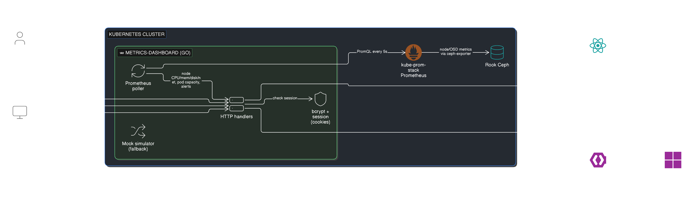

# Metrics Dashboard

A dark, dense, NOC-style live dashboard for a Kubernetes cluster + its Ceph
storage backend — node CPU/Mem/Disk/Net, pod capacity, Ceph health/OSD/IOPS,
and a rolling alerts/events feed. Built in Go (backend + data simulation) with
a small React/JSX frontend (loaded via CDN — no npm/build step needed).

This implements the **"Mission Control"** layout from the design exploration:
6 KPI tiles, ring-gauge cluster utilization, a 5×2 grid of per-node cards
(CPU/MEM ring gauges, pods, net, disk), and a right rail with the Ceph panel
plus alerts/events.

<!-- Screenshots — take PNGs into docs/screenshots/ and reference them:


-->

## Architecture



Details on the diagram: the app polls Prometheus every 5s for cluster and Ceph metrics, holds them in-memory, and serves a JSON snapshot to the React/JSX frontend. Users authenticate through Keycloak (OIDC, federated to Active Directory via LDAP) — successful login with the `dashboard-admin` realm role becomes an admin session; anyone else authenticated becomes a viewer. Full sequence + auth details in the sections below.

## Running it

You need Go 1.21+ installed (this was built/tested with Go 1.26).

The server requires authentication to be configured before it'll start (see
[Authentication & authorization](#authentication--authorization) below for
the full picture). The short version — generate two password hashes and a
session secret, then run:

```sh
go run . hash-password 'admin-password-here'   # → $2a$10$...
go run . hash-password 'viewer-password-here'  # → $2a$10$...
```

```sh
# macOS/Linux
export DASHBOARD_USERS='[
  {"username":"admin","password_hash":"$2a$10$<hash from above>","role":"admin"},
  {"username":"viewer","password_hash":"$2a$10$<hash from above>","role":"viewer"}
]'
export SESSION_SECRET="$(openssl rand -base64 32)"
go run .
```

```powershell
# Windows PowerShell
$env:DASHBOARD_USERS = '[{"username":"admin","password_hash":"$2a$10$<hash>","role":"admin"},{"username":"viewer","password_hash":"$2a$10$<hash>","role":"viewer"}]'
$env:SESSION_SECRET = [Convert]::ToBase64String((1..32 | ForEach-Object { Get-Random -Max 256 }))
go run .
```

Then open **http://localhost:8090** — you'll land on a sign-in page. The port
can be changed with the `PORT` env var, e.g. `PORT=9000 go run .`. (Default is
8090, not 8080, because 8080 is commonly taken by Docker Desktop / WSL on
Windows.)

To build a standalone binary:

```sh
go build -o dashboard.exe .
./dashboard.exe
```

## How it's put together

```
main.go         — HTTP server: routes, wiring, the admin-status handler and
                  the `hash-password` operator subcommand
auth.go         — authentication (login/logout, signed session cookies,
                  bcrypt password checks) and authorization (role middleware)
simulator.go    — generates a simulated 10-node cluster + Ceph cluster and
                  random-walks the values every 2s, just like a live system
types.go        — the data model shared between backend and frontend (Node,
                  Ceph, Event, Cluster, Snapshot)
static/         — the frontend: plain HTML + React (via CDN) + JSX compiled
                  in-browser by Babel — same approach as the design prototype,
                  so the visuals are pixel-accurate to the original mockup
  index.html    — page shell, fonts, loads the scripts in order
  shared.jsx    — palette/colors, number formatting helpers, and the
                  useLiveSnapshot/useMe/useAdminStatus hooks (all poll
                  authenticated JSON endpoints via the shared fetchJSON helper)
  viz.jsx       — reusable viz primitives: RingGauge, Donut, Bar, Sparkline,
                  StatusDot, HealthBadge, Panel, Delta
  dashboard.jsx — the actual dashboard layout (KPI strip, node cards, Ceph
                  rail, alerts panel, user/admin chips in the header)
  app.jsx       — mounts <Dashboard /> into #root
k8s/            — Kubernetes manifests for deploying this (see below)
Dockerfile      — multi-stage build → distroless runtime image
```

The frontend polls `GET /api/snapshot` every 2 seconds and re-renders with the
new numbers — the same cadence the simulator advances at, so it always shows
fresh data. Swapping the data source (see below) doesn't require any frontend
changes; it only returns a different `Snapshot`.

## Authentication & authorization

The whole app — the dashboard page and every `/api/*` endpoint — sits behind a
login. There are two roles:

- **`viewer`** — can sign in and see the dashboard and its live data.
- **`admin`** — everything a viewer can do, *plus* access to
  `/api/admin/status`, an operational/debug endpoint (server uptime,
  simulator tick count, Go runtime stats). The dashboard shows this as a
  small violet "ADMIN · UP …" chip in the header — viewers never see it, and
  the backend never even sends them that data.

### Why these secrets matter (plain-language explainer)

Three secrets show up everywhere in this project: **password hashes**,
**`SESSION_SECRET`**, and **`EMBED_TOKEN`**. Future-me will forget what they're
for — here's the short version.

#### Password hashes (in `DASHBOARD_USERS`)

Passwords must never be stored as plain text. Instead, we store a **bcrypt
hash** — a one-way fingerprint of the password. At login, the server hashes
what the user typed and compares it to the stored hash. If they match, login
succeeds; if the database leaks, attackers get hashes that take years to
brute-force one password.

The image itself contains a `hash-password` subcommand because the Go binary
already has the `bcrypt` library built in — saves installing extra tools on
the cluster:

```bash
kubectl run hash --rm -it --restart=Never \
  --image=harbor.devops.softnethq.co.tz/k8s_dashboard/metrics-dashboard:1.0.0 \
  --command -- /app/dashboard hash-password 'YourPassword'
```

Output: `$2a$10$abc...` — paste this into `DASHBOARD_USERS` as the
`password_hash` for that user.

(You can also use `htpasswd -bnBC 10 "" 'YourPassword'` or
`python3 -c "import bcrypt; print(bcrypt.hashpw(b'YourPassword', bcrypt.gensalt()).decode())"`
— all three produce the same kind of bcrypt hash. The image method just has
zero dependencies.)

#### `SESSION_SECRET` — the cookie signing key

When a user logs in, the server creates a session cookie holding
`{username, role, expiry}`. Without protection, anyone could edit the cookie
to say `role: admin` and bypass auth.

To prevent that, the server **HMAC-signs** the cookie payload with
`SESSION_SECRET` and appends the signature. On every request:

1. Server reads the cookie
2. Re-computes the HMAC with `SESSION_SECRET`
3. Compares to the signature in the cookie — mismatch = tampered = rejected

The secret never leaves the server. Without it, attackers can't forge a valid
signature. This also makes sessions **stateless**: no database needed, any
replica validates any cookie as long as they share the same secret.

**Why a fresh value per environment:** if dev and prod shared `SESSION_SECRET`,
a stolen dev cookie would be valid on prod. Always generate fresh per env:

```bash
openssl rand -base64 32
```

If you suspect a leak, rotate it. All existing sessions instantly become
invalid (everyone re-logs in).

#### `EMBED_TOKEN` — *(deprecated)* the bypass-login key for the TV kiosk

> **Deprecated**, kept for backwards compatibility. The TV wall now uses
> the `/tv/` kiosk mode (no auth, no cookie, no token). See
> [§ TV Wall Display — /tv/ kiosk mode](#tv-wall-display--tv-kiosk-mode-recommended) below.

The Samsung TV can't type a password. The `/embed?token=<EMBED_TOKEN>`
endpoint takes a static secret token, validates it, and silently issues a
viewer-role session cookie — no login prompt. See
[§ TV Wall Display — Embed Token](#tv-wall-display--embed-token) below for
the full story.

#### `OIDC_CLIENT_SECRET` — the Keycloak client password

When a user clicks "Sign in with Keycloak", our app talks to Keycloak using
the standard OAuth2 flow. Keycloak verifies our app is who it claims to be
using this client secret. Get it from Keycloak Admin → realm `SoftNet AD`
→ Clients → `metrics-dashboard` → Credentials tab.

---

How it works (`auth.go`):

- **Users** come from the `DASHBOARD_USERS` env var — a JSON array of
  `{"username", "password_hash", "role"}`. Passwords are never stored in
  plaintext; hash them with the built-in helper:

  ```sh
  go run . hash-password 'correct horse battery staple'
  ```

  which prints a bcrypt hash to put in `password_hash`. `role` must be
  `"admin"` or `"viewer"`.

- **Sessions** are signed, `HttpOnly`, `SameSite=Lax` cookies — `username` +
  `role` + expiry, HMAC-SHA256-signed with `SESSION_SECRET` (also from the
  environment; needs to be at least 16 bytes, ideally a random 32-byte value
  e.g. from `openssl rand -base64 32`). They're stateless: nothing is stored
  server-side, so any number of replicas can validate a session as long as
  they share the same `SESSION_SECRET` — no shared session store, no sticky
  sessions. Sessions last 12h (`sessionTTL` in `auth.go`); signing out
  (`POST /logout`, or the "Sign out" link in the header) clears the cookie
  immediately.

- **Routes**:
  - `GET/POST /login`, `POST /logout` — public
  - `/`, `/api/snapshot`, `/api/me` — any authenticated user
    (`auth.requireAuth`)
  - `/api/admin/status` — authenticated **and** `role == "admin"`
    (`auth.requireAuth` + `requireRole("admin", ...)`)

  A request with no/invalid session gets **401** from `/api/*` (or a redirect
  to `/login` for page navigations); an authenticated request to an
  admin-only route from a non-admin gets **403** — the frontend's
  `fetchJSON` helper treats those differently: 401 bounces to `/login`, 403
  on the admin-status poll just quietly stops polling.

- **Timing-safe checks**: failed logins always run a bcrypt comparison — even
  for usernames that don't exist — against a dummy hash, so response timing
  can't be used to enumerate valid usernames.

A couple of things worth knowing if you extend this:

- **`Secure` cookies**: `issueCookie` doesn't set the `Secure` flag, so
  `go run .` works over plain `http://localhost`. Once you're serving over
  HTTPS (e.g. via the [Gateway API HTTPRoute](#deploying-to-kubernetes) with
  TLS termination), flip it on in `auth.go`.
- **Rotating `SESSION_SECRET`** invalidates every existing session (everyone
  has to log in again) — that's a feature if you suspect it's been
  compromised, but plan for it during routine rotations.
- **Adding more roles or finer-grained permissions**: the pattern is
  `requireRole("some-role", handler)`, or write your own check against
  `sessionFromContext(r.Context())` inside a handler for anything more
  specific than a flat role match.

### Login page

`GET /login` renders a split-screen sign-in page:

- **Left panel** — branding, plus a live status card:
  - `DATA SOURCE` — `"Prometheus (live cluster)"` when `PROMETHEUS_URL` is
    set (i.e. `*RealSource` is the active data source), or `"Simulated data
    (demo mode)"` when running on the built-in simulator. Backed by the
    `dataSourceStatus` interface (`SourceLabel()` / `Healthy()`),
    implemented by both `*Simulator` and `*RealSource` (see `simulator.go` /
    `real_source.go`).
  - `STATUS` — `Operational` / `Degraded`, from the same interface's
    `Healthy()`. For `*RealSource` this reflects whether the most recent
    Prometheus scrape returned at least one node; the simulator is always
    healthy.
- **Right panel** — "Continue with Keycloak SSO" (only shown if OIDC is
  configured — see below) and the local username/password form.

### Keycloak SSO (OIDC) — optional

In addition to `DASHBOARD_USERS`, the dashboard can authenticate against any
OpenID Connect provider (e.g. Keycloak) via the standard OAuth2
Authorization Code flow (`oidc.go`). It's entirely optional: if any of the
env vars below are missing, OIDC is disabled, the "Continue with Keycloak
SSO" button is hidden, and local credentials work exactly as before.

| Var | Purpose |
|---|---|
| `OIDC_ISSUER_URL` | Issuer URL, e.g. `https://keycloak.example.com/realms/myrealm` |
| `OIDC_CLIENT_ID` | A confidential client configured in that realm |
| `OIDC_CLIENT_SECRET` | The client's secret |
| `OIDC_REDIRECT_URL` | Must exactly match the client's "Valid Redirect URI", e.g. `http://localhost:8090/login/oidc/callback` |
| `OIDC_ADMIN_ROLE` | Realm role mapped to the dashboard's `admin` role (default `dashboard-admin`); any other authenticated user gets `viewer` |

Routes added only when OIDC is enabled:

- `GET /login/oidc` — redirects to the provider's login page. A random
  `state` (CSRF guard) and `nonce` (ID-token replay guard) are generated and
  stashed in a short-lived signed cookie, using the same HMAC mechanism as
  session cookies (`SESSION_SECRET`).
- `GET /login/oidc/callback` — validates `state` against the cookie,
  exchanges the authorization code, verifies the ID token (issuer, audience,
  nonce), derives the username from `preferred_username` → `email` → `sub`
  (first non-empty), maps the realm roles in `realm_access.roles` to
  `admin`/`viewer` via `OIDC_ADMIN_ROLE`, then issues the same session cookie
  a local-credentials login would.

On any failure, the callback redirects back to `/login?error=1` — check the
server logs for the underlying reason.

### Creating the Keycloak client (metrics-dashboard)

These steps use the same realm as k8s-dashboard (`k8s dashboard`). Do this once before deploying with SSO enabled.

**1 — Open Keycloak Admin Console**
```
https://keycloak.devops.softnethq.co.tz/admin → Realm: k8s dashboard → Clients → Create client
```

**2 — Client settings**

| Field | Value |
|---|---|
| Client type | OpenID Connect |
| Client ID | `metrics-dashboard` |
| Name | Metrics Dashboard |
| Client authentication | **On** (makes it confidential) |
| Authorization | Off |
| Authentication flow | Standard flow only |

**3 — Login settings (next screen)**

| Field | Value |
|---|---|
| Valid redirect URIs | `https://metrics-dashboard.dev.softnethq.co.tz/login/oidc/callback` |
| Valid post logout redirect URIs | `https://metrics-dashboard.dev.softnethq.co.tz/` |
| Web origins | `https://metrics-dashboard.dev.softnethq.co.tz` |

Click **Save**.

**4 — Copy the client secret**

Go to **Credentials** tab → copy the value under **Client secret**.

**5 — Patch it into the Kubernetes Secret**

```bash
kubectl -n k8s-dashboard patch secret dashboard-auth \
  --type=merge \
  -p '{"stringData":{"OIDC_CLIENT_SECRET":"<paste-secret-here>"}}'
kubectl -n k8s-dashboard rollout restart deployment/metrics-dashboard
```

**6 — Assign realm roles to users**

Users need the realm role `dashboard-admin` (full access) or any other role (viewer access).
Go to **Users → <user> → Role mapping → Assign role** and pick `dashboard-admin`.
These are the same roles already used by k8s-dashboard — no new roles needed.

## Connecting it to a real cluster

Right now `main.go` wires up `*Simulator` as the `dataSource`:

```go
var source dataSource = sim
```

`dataSource` is just:

```go
type dataSource interface {
    Snapshot() Snapshot
}
```

To go live, write a type that builds a `Snapshot` (see `types.go`) from real
metrics and satisfies that interface, then swap the line above for
`source = NewRealSource(...)`. The simulator and the real source can even
coexist — e.g. fall back to simulated data if the real backend is unreachable.

The natural sources for the two halves of this dashboard:

### 1. Kubernetes node metrics → Prometheus + node-exporter / kube-state-metrics

If you're running `kube-prometheus-stack` (or any Prometheus scraping
node-exporter and kube-state-metrics), query it with the official Go client:

```sh
go get github.com/prometheus/client_golang/api
go get github.com/prometheus/client_golang/api/prometheus/v1
go get github.com/prometheus/common/model
```

```go
import (
    "context"
    "time"

    "github.com/prometheus/client_golang/api"
    promv1 "github.com/prometheus/client_golang/api/prometheus/v1"
)

client, _ := api.NewClient(api.Config{Address: "http://prometheus:9090"})
papi := promv1.NewAPI(client)

result, _, err := papi.Query(context.Background(),
    `100 - (avg by (instance) (rate(node_cpu_seconds_total{mode="idle"}[2m])) * 100)`,
    time.Now())
```

PromQL you'd map onto each `Node` field:

| Dashboard field      | PromQL (node-exporter / kube-state-metrics)                                                          |
|----------------------|-------------------------------------------------------------------------------------------------------|
| `cpu` (%)            | `100 - avg by (instance)(rate(node_cpu_seconds_total{mode="idle"}[2m])) * 100`                        |
| `mem` (%)            | `100 * (1 - node_memory_MemAvailable_bytes / node_memory_MemTotal_bytes)`                              |
| `diskR` / `diskW`    | `rate(node_disk_read_bytes_total[1m])` / `rate(node_disk_written_bytes_total[1m])` (÷ 1e6 for MB/s)   |
| `netIn` / `netOut`   | `rate(node_network_receive_bytes_total{device!="lo"}[1m])` / `..._transmit_bytes_total...` (×8 ÷ 1e6) |
| `status`             | `kube_node_status_condition{condition="Ready",status="true"}` and `kube_node_spec_unschedulable`       |
| `pods` / `podsCap`   | `kube_pod_info` (count by node) / `kube_node_status_capacity{resource="pods"}`                         |
| `role`               | `kube_node_role` or label-match on `node-role.kubernetes.io/control-plane`                             |

Build `cpuHist`/`memHist`/`netHist` either by running a Prometheus *range*
query (`papi.QueryRange`) over the last ~96s at 2s steps, or — simpler — by
keeping your own ring buffer in Go and appending the latest sample each time
you poll, exactly like the simulator's `pushHist` does.

You can also talk to the Kubernetes API directly (via
`k8s.io/client-go`) for node status/conditions/pod counts if you'd rather not
depend on kube-state-metrics — `client-go`'s `NodeList`/`PodList` plus the
`metrics.k8s.io` API (from `metrics-server`) give you live CPU/Mem without
Prometheus at all. Prometheus is recommended here mainly because it also gives
you history for the sparklines for free via range queries.

### 2. Ceph metrics → Ceph Manager (mgr) module

Two good options, in order of how much you already have running:

- **If Prometheus already scrapes Ceph** (via the `prometheus` mgr module —
  `ceph mgr module enable prometheus`), query the same Prometheus instance for
  `ceph_health_status`, `ceph_osd_up`, `ceph_osd_in`, `ceph_cluster_total_bytes`,
  `ceph_cluster_total_used_bytes`, `ceph_pool_*`, `ceph_osd_op_r`/`op_w` (for
  IOPS), and `ceph_osd_op_r_out_bytes`/`op_w_in_bytes` (for throughput).

- **Direct from the mgr REST API** — enable it with
  `ceph mgr module enable restful` (or use the newer `dashboard` module's API),
  then hit endpoints like `/health`, `/osd`, `/df` from Go with a plain
  `net/http` client + your mgr cert/credentials. This avoids a Prometheus
  dependency entirely if you just want this one dashboard.

Either way, map the responses onto the `Ceph` struct: `health`/`healthDetail`
from the health summary, `osdTotal`/`osdUp`/`osdIn`/`osdDown` from OSD map
counts, `rawTiB`/`usedTiB` from the cluster `df` stats, and
`readIOPS`/`writeIOPS`/`readMBs`/`writeMBs` from OSD perf counters (rate of
`op_r`/`op_w` and their byte counters).

### 3. Events → Kubernetes Events API + Ceph cluster log

For the alerts/events feed, watch the Kubernetes
[Events API](https://pkg.go.dev/k8s.io/client-go/kubernetes/typed/core/v1#EventInterface)
(`clientset.CoreV1().Events("").Watch(...)`) for `Warning`/`Normal` events, and
tail the Ceph cluster log (`ceph -w` equivalent — the mgr's `/health` /
`/cluster_log` endpoints, or subscribe via the `log` mgr module) for OSD/PG
events. Map each into an `Event{Sev, Src, Obj, Msg, Time}` and prepend it to
your in-memory ring buffer, same as `Simulator.step()` does.

### Putting it together

A `RealSource` would typically look like:

```go
type RealSource struct {
    prom *promv1.API
    // ... ceph client, k8s clientset, event buffer + mutex, etc.
}

func (r *RealSource) Snapshot() Snapshot {
    nodes := r.queryNodes()   // Prometheus + kube-state-metrics
    ceph  := r.queryCeph()    // Prometheus (ceph exporter) or mgr REST
    events := r.recentEvents() // buffered from k8s Events watch + ceph log tail
    cluster := deriveCluster(nodes) // same aggregation as Simulator.Snapshot
    return Snapshot{Nodes: nodes, Ceph: ceph, Events: events, Cluster: cluster}
}
```

Refresh it on the same ~2s cadence (a `time.Ticker` caching the latest
snapshot behind a `sync.RWMutex`, just like `Simulator`) so `/api/snapshot`
stays cheap to serve even under heavy polling — don't query Prometheus/Ceph
synchronously inside the HTTP handler.

## Building the container image

The `Dockerfile` is a multi-stage build: it compiles a static binary with the
Go toolchain, then copies *just that binary* into a
[distroless](https://github.com/GoogleContainerTools/distroless) base image —
no shell, no package manager, runs as a non-root user. The whole `static/`
frontend is embedded into the binary at compile time (`//go:embed static` in
`main.go`), so the final image is just one executable.

```sh
docker build -t k8s-ceph-dashboard:latest .

# generate hashes/secret using the image itself, so you don't need a local Go toolchain
docker run --rm k8s-ceph-dashboard:latest hash-password 'admin-password-here'
```

To run it locally exactly as it'll run in the cluster:

```sh
docker run --rm -p 8090:8090 \
  -e DASHBOARD_USERS='[{"username":"admin","password_hash":"$2a$10$...","role":"admin"}]' \
  -e SESSION_SECRET="$(openssl rand -base64 32)" \
  k8s-ceph-dashboard:latest
```

If you're deploying to a remote cluster, push the image to a registry it can
pull from and update the `image:` field in `k8s/deployment.yaml` accordingly
(e.g. `ghcr.io/you/k8s-ceph-dashboard:latest`). For a local cluster (kind,
minikube, k3d, Docker Desktop's Kubernetes), you can usually load the image
directly without a registry — e.g. `kind load docker-image
k8s-ceph-dashboard:latest` or `minikube image load k8s-ceph-dashboard:latest`.

## Deploying to Kubernetes

Manifests live in `k8s/`:

```
k8s/namespace.yaml       — the `dashboard` namespace everything else lives in
k8s/config.yaml          — ConfigMap with non-secret env vars (PORT, PROMETHEUS_URL, ...)
k8s/secret.example.yaml  — documents the Secret shape; DO NOT apply directly
k8s/deployment.yaml      — 2 replicas, probes, resource limits, non-root
k8s/service.yaml         — ClusterIP Service fronting the pods on port 80
k8s/httproute.example.yaml — example Gateway API HTTPRoute via main-gateway, TLS termination (rename + edit)
```

**1. Create the namespace, config, and auth Secret.** Generate real
credentials — don't hand-edit `secret.example.yaml` and apply it; create the
Secret imperatively so the values never touch a file on disk (and definitely
never git):

```sh
kubectl apply -f k8s/namespace.yaml
kubectl apply -f k8s/config.yaml

HASH_ADMIN=$(docker run --rm k8s-ceph-dashboard:latest hash-password 'pick-a-real-admin-password')
HASH_VIEWER=$(docker run --rm k8s-ceph-dashboard:latest hash-password 'pick-a-real-viewer-password')
SESSION_SECRET=$(openssl rand -base64 32)

kubectl create secret generic dashboard-auth -n dashboard \
  --from-literal=DASHBOARD_USERS="[{\"username\":\"admin\",\"password_hash\":\"${HASH_ADMIN}\",\"role\":\"admin\"},{\"username\":\"viewer\",\"password_hash\":\"${HASH_VIEWER}\",\"role\":\"viewer\"}]" \
  --from-literal=SESSION_SECRET="${SESSION_SECRET}"
```

`k8s/config.yaml`'s `PROMETHEUS_URL` defaults to the in-cluster
`kube-prometheus-stack` Service name — adjust it to match your cluster
(namespace + Helm release name) before applying, or use the external
NodePort URL e.g. `http://192.168.200.15:30909`.

**2. Deploy.**

```sh
kubectl apply -f k8s/deployment.yaml
kubectl apply -f k8s/service.yaml
```

**3. Reach it.** Either expose it through your Gateway API HTTPRoute (copy
`k8s/httproute.example.yaml` to `k8s/httproute.yaml`, point `hostnames` and
`parentRefs` at your Gateway, then `kubectl apply -f k8s/httproute.yaml` —
TLS terminates at the Gateway's HTTPS listener, and once it's serving HTTPS,
flip the session cookie's `Secure` flag on in `auth.go`'s `issueCookie`), or
for a quick local check:

```sh
kubectl port-forward -n dashboard svc/dashboard 8090:80
# → http://localhost:8090
```

**Notes on the Deployment:**

- It runs **2 replicas** behind a plain `ClusterIP` Service — safe because
  sessions are stateless signed cookies (see
  [Authentication & authorization](#authentication--authorization)); both
  pods validate sessions issued by either, no affinity needed.
- `runAsNonRoot`, `readOnlyRootFilesystem`, dropped capabilities, and a
  `RuntimeDefault` seccomp profile are all set — the distroless image needs
  no writable filesystem at runtime, so this costs nothing.
- `readinessProbe`/`livenessProbe` hit `/login`, which is the one route that's
  always reachable without credentials and exercises the full HTTP stack.
- If you switch to the simulated-data-replaced-by-real-cluster setup described
  above and that real source needs to talk to the Kubernetes API itself
  (via `client-go`), you'll additionally need a `ServiceAccount` with an
  RBAC `ClusterRole`/`ClusterRoleBinding` granting `get`/`list`/`watch` on
  `nodes`, `pods`, and `events` — that's not included here since the
  simulator needs no cluster access at all.


Test credentials (bcrypt-hashed in the Secret — change before any real use):
- admin: admin / TestAdmin#2026
- viewer: viewer / TestViewer#2026/exit

## TV Wall Display — `/tv/` kiosk mode (recommended)

The `/tv/` endpoint serves the dashboard with **no authentication required** —
no login form, no cookie, no token. The TV iframe just hits
`http://<host>/tv/` and the React SPA renders with public read-only data.

### How it works

```
iframe → GET /tv/                       ← serves the SPA (index.html + jsx)
       → GET /tv/me        → {"role":"viewer","username":"tv"}
       → GET /tv/snapshot  → live node/Ceph/event data
```

The SPA bundle is the same one served at `/`. `shared.jsx` checks
`window.location.pathname.startsWith('/tv')` at load time and switches
every `fetch('/api/...')` to `fetch('/tv/...')`. The `/tv/*` routes are
registered without `auth.requireAuth` (see `main.go`).

### Why `/tv/` and not `/embed?token=...`

The original embed-token approach set a `SameSite=Lax` session cookie. Modern
browsers block third-party cookies in cross-port iframes — so after the
initial load, subsequent `/api/snapshot` polls lost the cookie, hit
`302 → /login`, and the JSON parser failed on the HTML response
(`Unexpected token '<', '<!DOCTYPE'... is not valid JSON`).

`/tv/` avoids the cookie problem entirely. Works identically across Chrome,
Firefox, Safari, and any TV kiosk browser regardless of third-party-cookie
settings.

### Security stance

- The TV server (`192.168.200.78`) is on the internal LAN — not internet-exposed.
- `/tv/*` only returns operational health data — no secrets, no
  pod-environment-variables, no node names beyond what's already public.
- No POST endpoints exist under `/tv/` (no admin export, no logout, no
  state changes possible).
- The `/api/admin/status` endpoint is **not** exposed under `/tv/` —
  `useAdminStatus` enables itself only when the role is `admin`, and
  `/tv/me` returns `viewer`, so admin polling never fires.
- If exposing externally, gate `/tv/*` by source IP at the Gateway/Ingress.

### Setting up the TV iframe

```html
<iframe src="http://192.168.200.78:9094/tv/"></iframe>
```

The trailing slash matters — the route is mounted as a directory so the SPA
can resolve its relative `shared.jsx`, `dashboard.jsx`, etc. assets.

---

## TV Wall Display — Embed Token (deprecated)

> **Deprecated:** The `/embed?token=…` endpoint still works for backwards
> compatibility but is no longer used by the SoftNet TV wall. Prefer the
> `/tv/` kiosk mode above — simpler, no cookie issues in iframes, no token
> rotation needed.

The `/embed` endpoint lets a kiosk (e.g. a Samsung TV) load the dashboard in
an iframe without a username/password. A static secret token is validated
server-side; the browser receives a read-only `viewer` session cookie. Normal
logins (password and Keycloak SSO) are completely unchanged.

### How it works

```
iframe → GET /embed?token=<EMBED_TOKEN>
            ↓  token validated (constant-time compare)
            ↓  Set-Cookie: dashboard_session  (role=viewer, 12 h)
            ↓  302 → /
iframe → GET /  (cookie sent — same LAN IP, SameSite=Lax allows different port)
            ↓  dashboard loads in read-only viewer mode
```

The token lives in the `dashboard-auth` Kubernetes Secret as `EMBED_TOKEN`.
**Never commit it to git.**

### Step 1 — Generate a token (on the server)

```bash
openssl rand -hex 32
```

### Step 2 — Patch it into the Secret

```bash
kubectl -n k8s-dashboard patch secret dashboard-auth \
  --type=merge \
  -p "{\"stringData\":{\"EMBED_TOKEN\":\"$(openssl rand -hex 32)\"}}"
```

### Step 3 — Read the token back (to paste into tv.html)

```bash
kubectl -n k8s-dashboard get secret dashboard-auth \
  -o jsonpath='{.data.EMBED_TOKEN}' | base64 -d && echo
```

### Step 4 — Restart the deployment

```bash
kubectl -n k8s-dashboard rollout restart deployment/metrics-dashboard
```

### Step 5 — Set the iframe URL in tv.html

Use the **HTTP NodePort** to avoid the self-signed TLS certificate error on the
Samsung TV browser:

```html
<iframe src="http://192.168.200.15:32029/embed?token=<your-token>"></iframe>
```

### Cookie behaviour by protocol

| Access path | SameSite | Secure | When to use |
|---|---|---|---|
| HTTP NodePort `:32029` | `Lax` | No | Samsung TV kiosk (same LAN IP) |
| HTTPS Istio Gateway | `None` | Yes | Cross-domain iframe over TLS |

The `/embed` handler detects the protocol via `X-Forwarded-Proto` and sets the
cookie attributes automatically — no code change needed when switching between
the two paths.

### Rotating the token

If you suspect the token was leaked:

```bash
kubectl -n k8s-dashboard patch secret dashboard-auth \
  --type=merge \
  -p "{\"stringData\":{\"EMBED_TOKEN\":\"$(openssl rand -hex 32)\"}}"
kubectl -n k8s-dashboard rollout restart deployment/metrics-dashboard
```

Update `tv.html` with the new token and push — the old token stops working
as soon as the pod restarts.